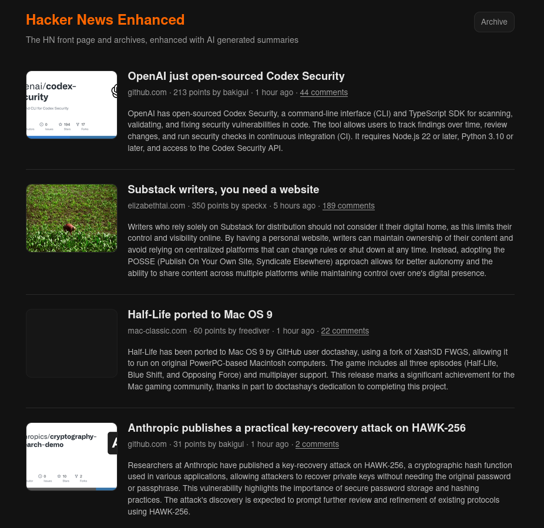

# HN Express

Shows the Hacker News front page (via the official HN API, in HN's own rank order), with an AI-generated summary and representative image for each linked article. Summaries are generated in the background by the [Claude API](https://www.anthropic.com/api) — never on the request path. The web UI is plain server-rendered HTML that only reads from a local SQLite database.

## Screenshot



## Code organization

Three npm workspaces sharing one SQLite file:

- `db/` — SQLite schema + query helpers.
- `worker/` — background process: polls the HN API into the database, then summarizes articles (fetch → extract text/image, falling back to a headless browser when needed → Claude API).
- `web/` — Express server that renders the front page from the database.

## Prerequisites

- Node.js 22.5+ (uses the built-in `node:sqlite`; developed on Node 26).
- An [Anthropic API key](https://console.anthropic.com), set as `ANTHROPIC_API_KEY` (see Configuration below).

## Setup

```
npm install
npx playwright install chromium
```

Copy `.env.example` to `.env` and set `ANTHROPIC_API_KEY` (every other setting has a working default):

```
cp .env.example .env
```

## Running everything together

```
npm run dev
```

Runs the web server and worker side by side (via `concurrently`). Then open `http://localhost:3000`.

The first load will be empty until the worker's first HN fetch completes; summaries fill in gradually as the worker processes them, and the page auto-refreshes every 20s while any are still pending.

## Running the worker standalone

From the repo root:

```
npm start -w worker
```

Or from inside `worker/`:

```
cd worker
npm start
```

This runs all three worker loops continuously: refetching the HN front page every `FETCH_INTERVAL_MS` (default 15 min), continuously draining any stories that don't have a summary yet, and purging stories (no longer on the front page) first seen more than `CLEANUP_MAX_AGE_DAYS` ago (default 14 days) every `CLEANUP_INTERVAL_MS` (default 24h).

For a one-off manual run instead of the continuous loop:

```
npm run fetch:once -w worker       # fetch the current HN front page once
npm run summarize:once -w worker   # summarize all currently-pending stories once, then exit
npm run cleanup:once -w worker     # purge stories older than CLEANUP_MAX_AGE_DAYS once, then exit
```

### Retrying failed summaries

Stories whose summary failed (extraction or Claude API error) are marked `failed` and are **not** retried automatically — this avoids hammering a broken endpoint indefinitely. Once whatever caused the failures is fixed (e.g. a missing `ANTHROPIC_API_KEY` or a rate limit), requeue and reprocess them:

```
npm run retry-failed -w worker
```

This resets every `failed` story back to `pending` and immediately drains the whole pending queue (same as `summarize:once`).

If you're running the continuous worker instead, pass `--retry-failed` (or set `RETRY_FAILED=true`) to requeue everything once at startup, then continue as normal:

```
npm start -w worker -- --retry-failed
```

## Running the web server standalone

From the repo root:

```
npm start -w web
```

Or from inside `web/`:

```
cd web
npm start
```

Serves the UI at `http://localhost:3000` (or `$PORT`) purely from whatever is already in the SQLite database — it never fetches from HN or calls the Claude API itself, so run the worker (at least once) separately to populate data.

## Running with Docker

Each workspace has its own `Dockerfile` (`web/Dockerfile`, `worker/Dockerfile`); both are built from the **repo root** as the build context, since they need the sibling `db/` package. `docker-compose.yml` runs both together, bind-mounting `$HOME/.config/hn/data` from the host into both containers so they share the same SQLite database — the same path the app uses by default outside Docker (see [Data](#data)).

Set `ANTHROPIC_API_KEY` in `.env` before running — the worker container needs it to call the Claude API and there's no default.

### Both together (compose)

```
docker compose up --build
```

Then open `http://localhost:3000`. Copy `.env.example` to `.env` first and set `ANTHROPIC_API_KEY` — compose reads it automatically for the defaults shown in `docker-compose.yml` (`HN_FRONTPAGE_SIZE`, `CLAUDE_MODEL`, `PORT`, etc.).

### Worker standalone (Docker)

```
docker build -f worker/Dockerfile -t hn-express-worker .
docker run --rm \
  -e ANTHROPIC_API_KEY=sk-ant-... \
  -e CLAUDE_MODEL=claude-haiku-4-5 \
  -v "$HOME/.config/hn/data:/root/.config/hn/data" \
  hn-express-worker
```

### Web standalone (Docker)

```
docker build -f web/Dockerfile -t hn-express-web .
docker run --rm -p 3000:3000 -v "$HOME/.config/hn/data:/root/.config/hn/data" hn-express-web
```

Uses the same host bind mount as the worker above so both containers see the same database.

## Configuration

All configuration is via environment variables (see `.env.example` for the full list and defaults), including `PORT`, `HN_FRONTPAGE_SIZE`, `FETCH_INTERVAL_MS`, `SUMMARY_CONCURRENCY`, `ANTHROPIC_API_KEY`, and `CLAUDE_MODEL`.

## Data

The SQLite database lives at `$HOME/.config/hn/data/hn.sqlite3` (created automatically on first run, including under Docker via a bind mount to the same host path — see [Running with Docker](#running-with-docker)). Delete it to start fresh. Override the location with `DB_PATH` (see `.env.example`).
